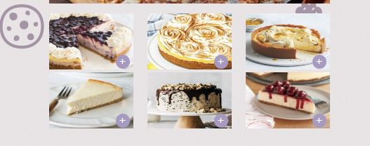
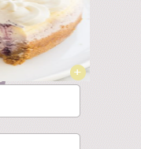
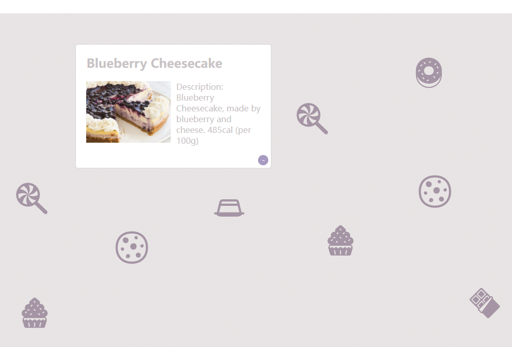
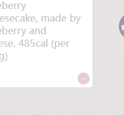
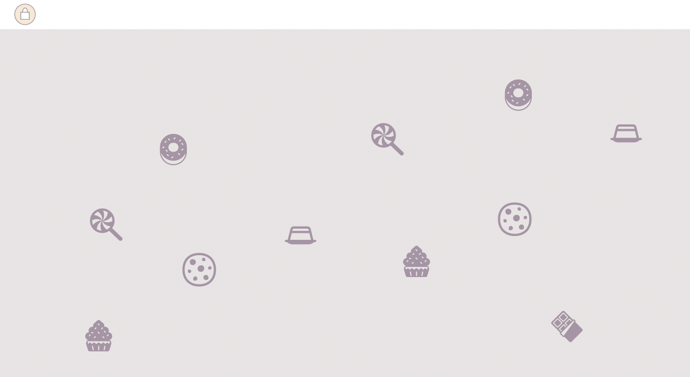
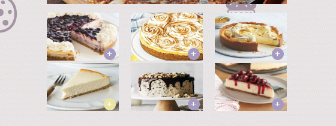
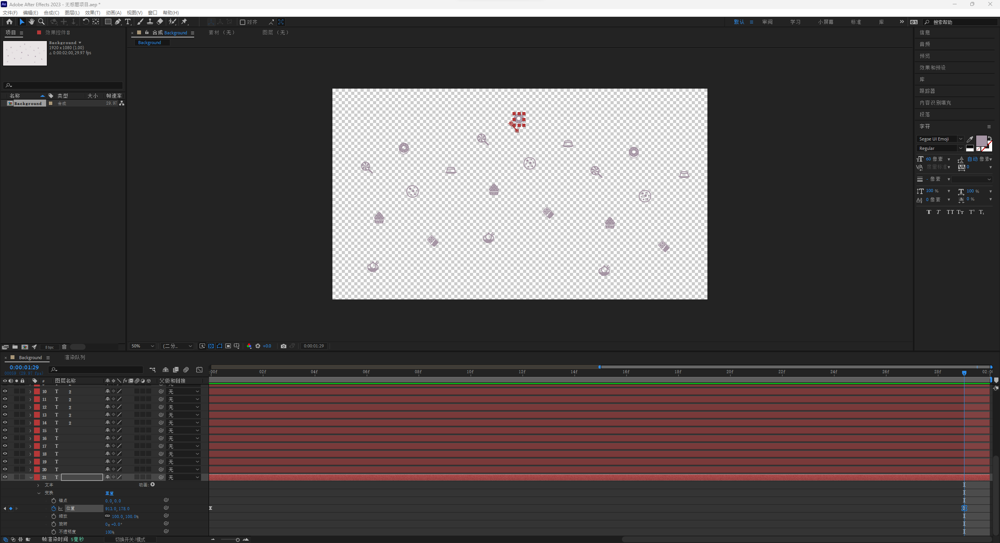
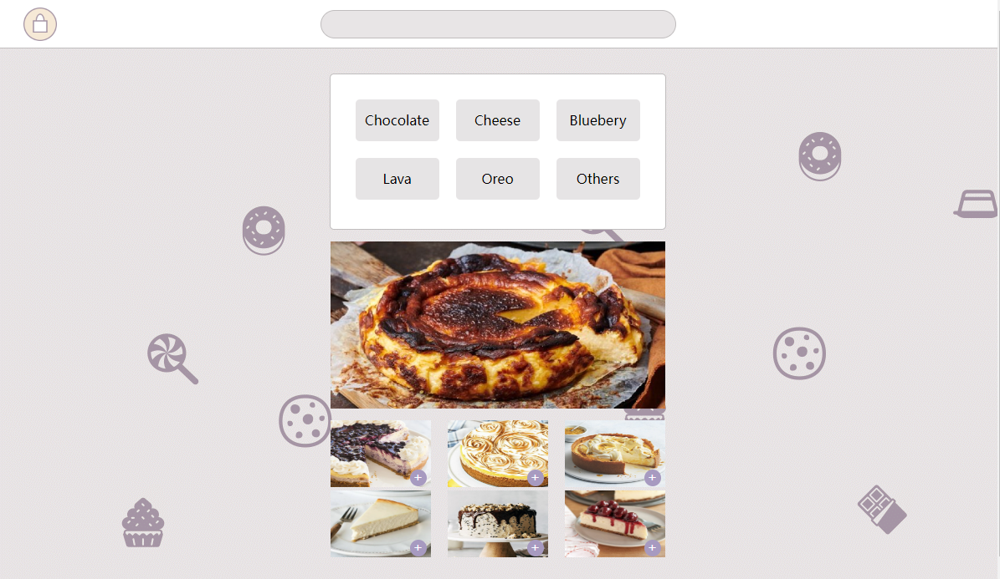

# README File_DECO2017_Web App Prototype_xlyu5678

## Description
>The website is designed for users to get information on different cake recipes and provide users with different cake recipes.

## Experience flow
### 1. Adding item from the details page
* Homepage, click on a cake picture to access the detail page.

* See the details page and click on the adding button on the right corner of the picture. (When hovering it will turn yellow.)

* Click on the "Bag icon" at the left top corner of the details page.

* It will get back to the homepage. Click the button again, it could access the list page now.

* Click on the minus button (when hovering it will turn pink)

* It will delete the item now.

### 2. Directly adding items to the list from the homepage
* Homepage, click on the adding button on the right bottom corner of each picture. (When hovering it will turn yellow.)

* Click the "Bag icon" at the left top corner, it will access the list page now.

* After seeing the list, the user could click on the minus button (when hovering it will turn pink)

* It will delete the item now.

## Web app background design
* The background(the moving food icons) is made by Adobe After Effect. 

## Code describe
* Storing the food information at home.js.
* When the user clicks on adding or minus button, it will check the list and put the item into the list or move them out of the list.
* On the homepage, make sure the user could access different cake recipes, by clicking on the picture of the cake. The pictures were linked to the details.js and it will judge the item that the user clicks on to link to each details page.

## Iteration
### The position of the shopping bag icon
* In the final mockup, the "bag icon" position on the homepage changes from the right corner to the left top of the navigation bar.

## Future possible improvements
### The homepage sliding picture
* The biggest picture could be sliding automatically showing more pictures of the cake.

### The Background
* The background could be using P5.js to make the icons move randomly and linked to letting it be the website background.
### Link the list page item to the details page
* When staying on the list page, it could also access the details page by clicking on the item.

## References
* Aldous, R., Recipe by Royal Chef Mark Flanagan, Aldous, A., & Tuck, A. (2020, June 22).
Basque lemon cheesecake. Retrieved April 28, 2023, from
https://dish.co.nz/recipes/basque-lemon-cheesecake/?fbclid=IwAR2VukPyC-cEbWPEPhoS4Se
vys3ZxG7qhzGCyoP9BzMraILQPE9Koi4yUUM
* Crosmataditele. (2019, June 14). Petitbonheur.cooking. Retrieved April 28, 2023, from:
https://crosmataditele.tumblr.com/post/185583332459/cutejapanesefood-petitbonheurcooking
* Camila. (2020, August 12). No-bake pistachio pie. Retrieved April 28, 2023, from
https://www.piesandtacos.com/no-bake-pistachio-pie/
* Cook, K. (2022, October 05). Homemade chocolate cake with chocolate frosting.
Retrieved April 28, 2023, from
https://www.creationsbykara.com/homemade-chocolate-cake-recipe/
* E U P H O R I A: Pretty birthday cakes, cute birthday cakes, Cute Cakes. (2022, May 20).
Retrieved April 28, 2023, from https://www.pinterest.com.au/pin/1196337397030090/
Emma ChristensenEmma ChristensenEmma is a former editor for The Kitchn and a
graduate of the Cambridge School for Culinary Arts. She is the author of True Brews and Brew
Better Beer. Check out her website for more cooking stories, Christensen, E., Emma
Christensen Emma is a former editor for The Kitchn and a graduate of the Cambridge School
for Culinary Arts. She is the author of True Brews and Brew Better Beer. Check out her website
for more cooking stories, & Emma is a former editor for The Kitchn and a graduate of the
Cambridge School for Culinary Arts. She is the author of True Brews and Brew Better Beer.
Check out her website for more cooking stories. (n.d.). How to make perfect cheesecake.
Retrieved April 28, 2023, from
https://www.thekitchn.com/how-to-make-perfect-cheesecake-recipe-cooking-lessons-from-the-
kitchen-110760
* Fehr, A. (2021, August 02). Perfect blueberry cheesecake - made easier! [video].
Retrieved April 28, 2023, from https://www.thereciperebel.com/blueberry-cheesecake/
* Jenna. (2022, February 12). Cookie dough cake - cookie dough is baked into each layer.
Retrieved April 28, 2023, from https://butternutbakeryblog.com/cookie-dough-cake/
* Loa, C., Naomi, & Miranda. (2012, August 03). Purple Ombre Mini Cakes. Retrieved April
28, 2023, from https://www.glorioustreats.com/purple-ombre-mini-cakes/
* Lindsay. (2022, December 14). Ultimate Oreo Cheesecake Recipe - the most amazing
Oreo cheesecake! Retrieved April 28, 2023, from
https://www.lifeloveandsugar.com/ultimate-oreo-cheesecake/print/34098/
No bake mini lotus Biscoff Cheesecake. (2017, March 09). Retrieved April 28, 2023, from
http://loveeatsleepfood.com/?p=3298
* Passionfruit Curd Ripple Cheesecake Recipe - taste.com.au. (n.d.). Retrieved April 28,
2023, from
https://www.taste.com.au/recipes/passionfruit-curd-ripple-cheesecake-recipe/ja4gd3pf?nk=10a
e5847f70e9fcbaaa6a88efe37ec9c-1672185093
* QueensleeAppetit, D., K96, Sonya, Aguirre, R., Clementineandcoriander, & Elle. (2021,
April 19). Lemon meringue cheesecake ~ recipe: Queenslee Appétit. Retrieved April 28, 2023,
from https://www.queensleeappetit.com/lemon-meringue-cheesecake/
* Reynolds, M. (2016, October 26). The target market for desserts. Retrieved April 28,
2023, from https://smallbusiness.chron.com/target-market-desserts-66760.html
* Roffey, M. (2022, June 10). Greek orange semolina cake with orange syrup. Retrieved
April 28, 2023, from
https://www.sugarsaltmagic.com/orange-semolina-cake/?utm_medium=social&utm_source=pi
nterest&utm_campaign=tailwind_tribes&utm_content=tribes&utm_term=734600900_29796312
_112269
* Statista Research Department, & 12, O. (2012, October 12). Comparison of age groups
regarding the consumption of desserts in 2012. Retrieved April 28, 2023, from
https://www.statista.com/statistics/244068/percentage-of-people-ordering-dessert-at-least-onc
e-a-week/